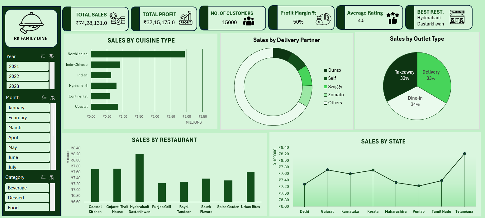

# 🍽️ Restaurant Sales Dashboard – Excel Data Analytics Project

A full interactive restaurant sales dashboard built completely in **Microsoft Excel** using Excel Functions, Power Query, Power Pivot, Pivot Tables, and Charts.
No Python. No SQL. No fancy BI tools pretending to be simple. Just Excel doing unpaid overtime like always.

---

## 📌 Project Overview

This project analyzes restaurant sales performance across:

* 🍛 Cuisine Types
* 🚚 Delivery Partners
* 🏪 Outlet Types
* 🧾 Restaurant Performance
* 🌍 State-wise Sales
* 📅 Year & Month Trends
* 🍹 Product Categories

The goal was to convert raw restaurant sales data into meaningful business insights through cleaning, transformation, modeling, and dashboard visualization.

---

# 🛠️ Tools & Technologies Used

| Tool            | Purpose                             |
| --------------- | ----------------------------------- |
| Microsoft Excel | Main analytics platform             |
| Excel Functions | Data cleaning & calculations        |
| Power Query     | Data transformation & preprocessing |
| Power Pivot     | Data modeling & relationships       |
| Pivot Tables    | Data summarization                  |
| Pivot Charts    | Interactive visualizations          |
| Slicers         | Dynamic filtering                   |

---

# 📂 Workflow

## 1️⃣ Data Cleaning using Excel Functions

Before creating the dashboard, the raw dataset needed cleaning because real-world data behaves like it was assembled during a power outage.

### Excel Functions Used

```excel
IF()
IFS()
XLOOKUP()
VLOOKUP()
TEXT()
LEFT()
RIGHT()
MID()
TRIM()
LEN()
COUNTIF()
SUMIF()
SUMIFS()
AVERAGEIF()
```

### Tasks Performed

* Removed extra spaces using `TRIM()`
* Standardized text formatting
* Handled blank/null values
* Created calculated columns
* Categorized records
* Extracted useful text patterns
* Calculated sales and profit metrics

---

# ⚡ Data Transformation using Power Query

Power Query was used to automate data cleaning and transformation processes.

## Steps Performed in Power Query

* Removed duplicates
* Changed data types
* Filtered unnecessary records
* Renamed columns
* Split and merged columns
* Handled null values
* Created custom columns
* Loaded optimized tables into Excel Data Model

Power Query saved a massive amount of manual work. Humans still insist on copy-pasting data row by row, which explains many things about civilization.

---

# 📊 Data Modeling with Power Pivot

Power Pivot was used to build relationships between multiple tables and improve analytical capabilities.

## Power Pivot Features Used

* Data Model creation
* Relationships between tables
* KPI calculations
* Measures for Sales & Profit analysis
* Optimized large dataset handling

### Example Measures

```DAX
Total Sales = SUM(Sales[Amount])

Total Profit = SUM(Sales[Profit])

Profit Margin % = DIVIDE([Total Profit],[Total Sales])
```

---

# 📈 Dashboard & Visualization

Interactive Pivot Tables and Pivot Charts were used to create the dashboard.

## Dashboard Features

✅ Dynamic Filters using Slicers
✅ Sales Trend Analysis
✅ Delivery Partner Performance
✅ Restaurant-wise Revenue Analysis
✅ State-wise Sales Comparison
✅ Cuisine Type Analysis
✅ Outlet Type Distribution
✅ KPI Cards for Quick Insights

---

# 🔍 Key Insights Found

### 🍛 Cuisine Analysis

* North Indian cuisine generated the highest sales contribution.
* Continental and Coastal cuisines showed lower customer demand.

### 🚚 Delivery Partner Analysis

* Delivery sales were distributed across multiple partners like Swiggy, Zomato, Dunzo, and Self Delivery.
* Some missing partner values highlighted potential data quality issues.

### 🏪 Outlet Analysis

* Delivery, Takeaway, and Dine-in sales contributed almost equally.

### 🌍 State-wise Performance

* Telangana recorded the highest sales among all states.
* Some states showed stable but moderate growth trends.

### 🧾 Restaurant Performance

* Hyderabadi Dastarkhwan emerged as the top-performing restaurant.

---

# 🎯 What I Learned

This project helped me improve:

* Data Cleaning Skills
* Excel Automation
* Dashboard Design
* Business Data Analysis
* Data Visualization
* DAX Basics
* Power Query Transformation
* Analytical Thinking

More importantly, it proved Excel is still dangerously powerful when used properly. People mock spreadsheets until quarterly revenue disappears because someone deleted column G.

---

# 📸 Dashboard Preview



---

# 🚀 Future Improvements

* Add forecasting analysis
* Include customer segmentation
* Connect live data sources
* Build Power BI version
* Add advanced DAX measures

---

# 📬 Connect With Me

### 💼 LinkedIn

Add your LinkedIn profile here

### 📧 Email

Add your email here

---

# ⭐ If You Like This Project

Give this repository a star ⭐
It helps the project reach more people and motivates me to build more data analytics projects. Excel deserves respect. Or at least less abuse.
